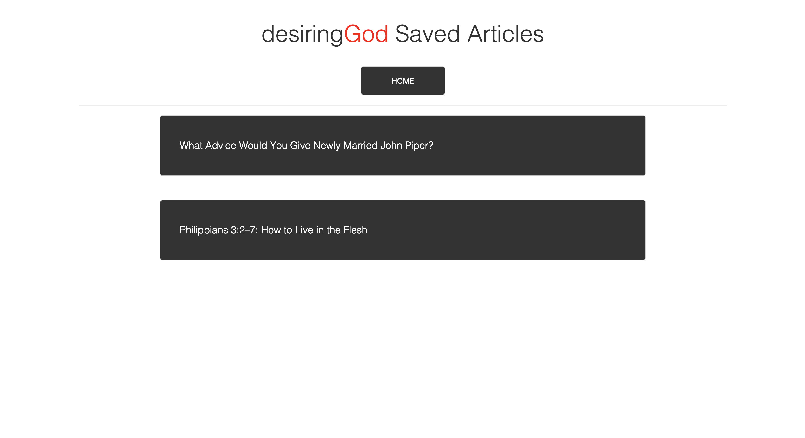

# NewsScraper
Article scraper to grab news articles. The user can save articles and comment on them as well. Click the link below to visit the Heroku deployed site. 

[NewsScraper](https://glacial-tundra-78062.herokuapp.com/)


## Dependencies
The package dependencies needed for the app to run are: Axios, Cheerio, Express, Handlebars, and Mongoose
```
npm i axios cheerio express express-handlebars mongoose
```

## How to use the site
NewsScraper will reach out to desiringGod.org using Axios and will scrape the site using Cheerio to find two properties: the article names and the url for the corresponding article. At the top of the home page are two buttons "New Articles" and "Saved Articles". By pressing the "New Articles" button our site will reach out desiringGod.org again and look for the newest top articles and repopulate the page. (see below)


You will then be able to save or unsave any articles that look interesting to you. Think of this like a bookmark function. Then you can click the "Saved Articles" button at the top of the page to see the articles you saved for later. (see below)


Once you go to the "Saved Articles" page you will see the pages you wanted to visit later. (see below)




> *Thanks for visiting.*
> *For questions about the project email me: cmmclaughlin7@gmail.com*
